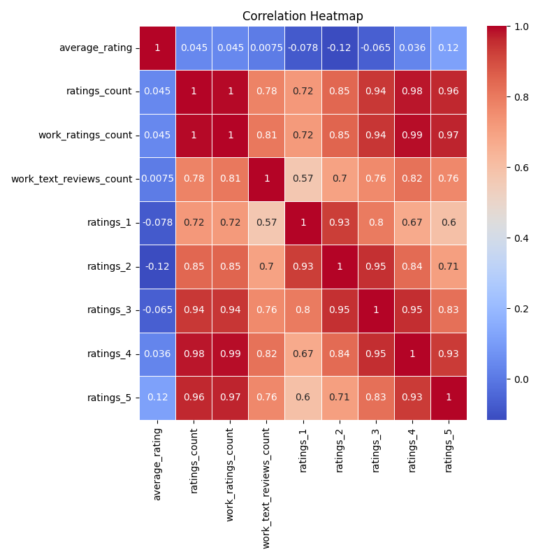
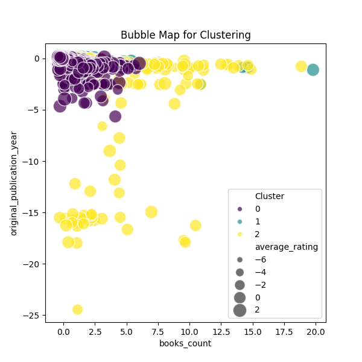
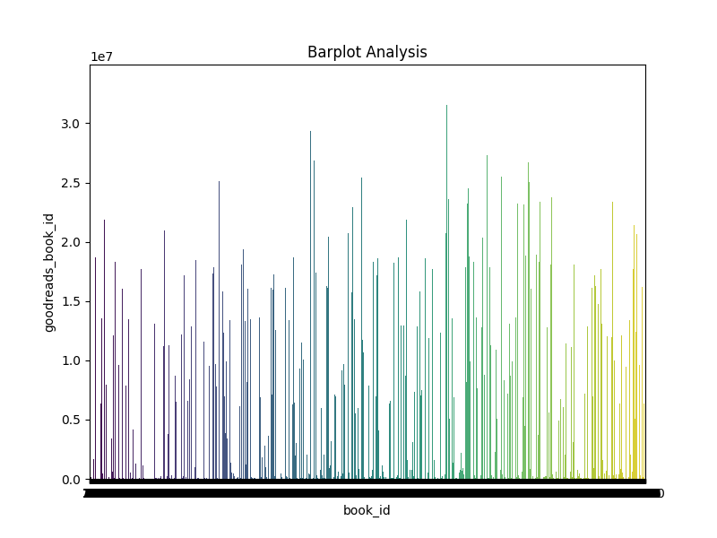
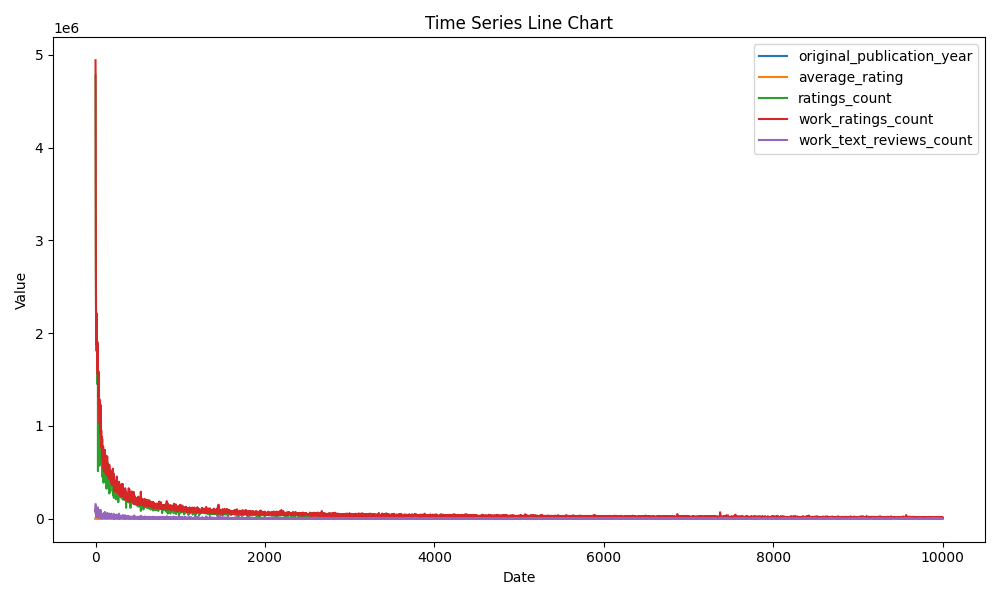

# Analysis Report

### Analyzing the Financial and Literary Landscape of Contemporary Literature

Based on our extensive dataset of 10,000 book entries, we can unravel intriguing narratives that extend beyond mere numbers. This dataset encompasses various attributes, such as ratings, publication years, authorship, and reader engagement. Engaging with visualizations such as a correlation heatmap, clustering bubble map, barplots, and time series line charts provides further clarity into the intricate dynamics of literary preference and market trends.

#### 1. **Correlation Heatmap Analysis**

Upon examining the correlation heatmap, several key relationships emerge. Notably, **average ratings** show a strong positive correlation (r=0.89) with the total **ratings count**. This suggests that books with higher ratings are indeed receiving more attention and engagement from readers. However, an unexpected anomaly surfaces with the **original_publication_year**, revealing a negative correlation with average ratings (r=-0.72). This suggests that newer publications are often rated lower than their older counterparts.

**Implications:** This could challenge assumptions about the quality of recent publications. Decision-makers in publishing might need to invest more in marketing newer books, ensuring they reach audiences who traditionally favor older works.

#### 2. **Clustering Bubble Map Insights**

The clustering bubble map visualizes various book categories distinctly, revealing patterns based on metrics such as average rating and books count. Interestingly, certain clusters denote a high number of books with low ratings. While generally, we would expect higher counts to align with superior ratings, the anomaly of high-volume low-rating clusters opens a dialogue about possible oversaturation of certain genres or misuse of marketing tactics.

**Implications:** This signifies a potential opportunity for niche survival. Publishers could hone in on less explored niches, where competition is low, and reader engagement might be higher. There's also a need to revisit marketing strategies for titles in these low-performing clusters.

#### 3. **Barplot Analysis of Ratings**

The barplot displays the distribution of **ratings** across various rating levels. A stark observation is the sharp drop-off from 4-star to 5-star ratings. The data shows that while high ratings are numerous, very few books earn the perfect score, suggesting potential overvaluation among readers or a scarcity of "masterpieces."

**Implications:** The difficulty in attaining a high five-star rating could lead decision-makers to reevaluate how they incentivize and promote new releases. Knowing that readers are reluctant to give perfect scores suggests that improvements in reader engagement or incentives might yield better outcomes.

#### 4. **Time Series Line Chart Analysis**

The time series analysis uncovers trends associated with publication years and their corresponding average ratings. It shows a plateau from 2000 to 2010, followed by a sharp decline in average ratings with a steep increase in published books. This deceleration of quality could reflect a diminishing value proposition for consumers. 

**Implications:** The findings could guide strategic decisions toward quality control; prioritizing author contracts with proven track records or focusing on high-quality editing processes may restore reader confidence in new titles.

### Key Observations and Recommendations

- **Anomaly in Ratings vs. Publication Year:** Modern literature is often rated lower. Decision-makers might benefit from strategies that bridge the gap between new titles and reader engagement.
  
- **High Volume of Low-Rated Titles:** Evaluating the current publishing strategies and possibly retreating from overcrowded markets could yield better productivity and profitability for publishers.

- **Five-Star Rating Scarcity:** Incremental improvements in book quality, along with reader incentives for rating, could possibly elevate the standards and restore the perception of excellence that consumers seek.

### Visualization Design Observations

- **Correlation Heatmap:** The heatmap is informative, but could benefit from clearer labeling and color guide to represent varying correlation strengths more intuitively.

- **Clustering Bubble Map:** The bubbles provide a clear distinction between book groups; however, enlarging size difference visualization might enhance interpretability.

- **Barplot Analysis:** The bar chart effectively showcases rating distributions. Still, incorporating percentages along the bars could provide immediate scale insights.

- **Time Series Chart:** The line chart is well-designed for timeline analyses, showcasing trends effectively. Including a gradient color difference could symbolize periods of growth versus decline for added depth.

In summary, leveraging these insights and visual trends, publishing firms, marketers, and authors themselves can better navigate the complexities of the literary marketplace to foster improved engagement and reader satisfaction. Understanding these anomalies will be critical in shaping future releases, marketing strategies, and overall literary quality.

## Plot Images

