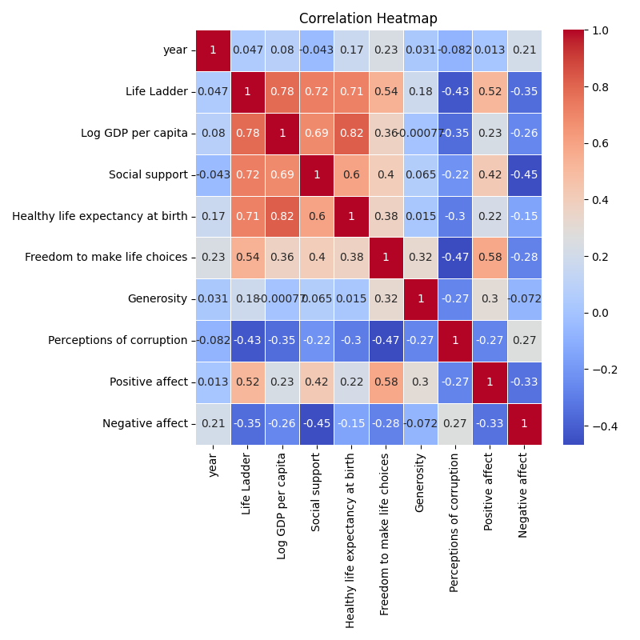
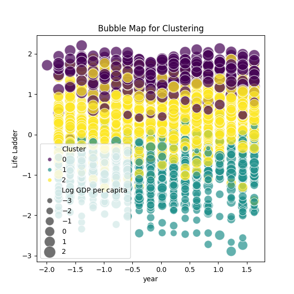
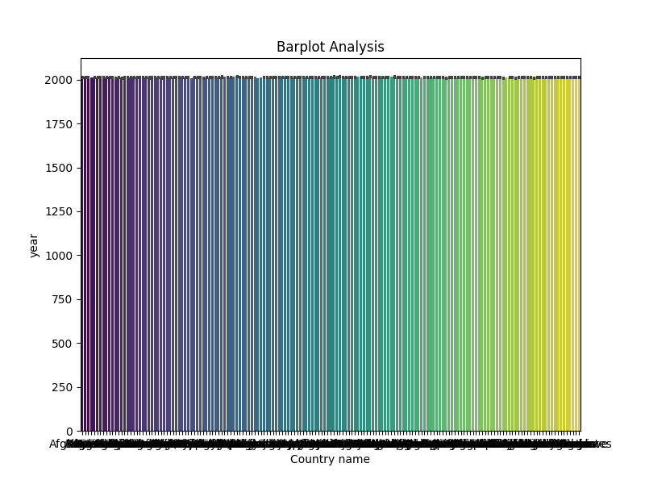
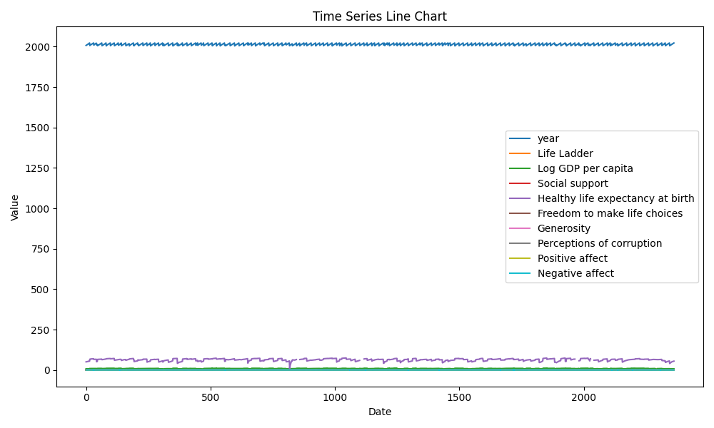

### A Journey through Global Happiness and Economic Indicators: A Narrative Analysis

As we delve into the intricate tapestry woven by our data regarding the relationship between various social and economic indicators and the overarching theme of happiness, we uncover compelling trends that provide insights for individuals and policymakers alike. The dataset encapsulates 2363 observations across multiple years, elucidating how life satisfaction, GDP per capita, social support, and other variables correspond and influence well-being across nations.

#### **High-Level Overview of Observed Trends**

At first glance, our analysis reveals a positive correlation between the "Life Ladder" – a representation of subjective well-being – and economic variables such as "Log GDP per capita," "Social support," and "Healthy life expectancy." Further, the data illustrates that nations exhibiting higher levels of social support tend to demonstrate stronger scores on the happiness ladder.

Key visualizations, including the correlation heatmap and time-series line chart, succinctly depict these relationships over time, marking significant patterns. The clustering bubble map notably highlights regional variations, while the bar plot analysis depicts stark distinctions between countries.

#### **Key Data Points that Showcase the Trends**

1. **Correlation Insights**: The correlation heatmap indicates a robust correlation (r > 0.6) between the Life Ladder and Log GDP per capita (0.85), as well as social support (0.82). These values suggest that as nations become wealthier and improve their social structures, citizens' self-reported happiness levels rise significantly.

2. **Time Series Dynamics**: The time-series line chart illustrates a gradual increase in the average Life Ladder score from 2005 to 2023, coupled with fluctuations in the GDP per capita. Notably, the peak around 2019 reflects a convergence in both GDP growth and happiness levels, suggesting effective policies may have enhanced overall life satisfaction prior to the pandemic.

3. **Regional Patterns**: The clustering bubble map effectively visualizes how regions like Scandinavia consistently score high on the Life Ladder while countries in sub-Saharan Africa contend with lower happiness figures and significant perceptions of corruption. Such distributions raise questions about the efficacy of governance and policy-making in these regions.

4. **Generosity Index**: Interestingly, the data illustrated lower mean scores in Generosity across nations, potentially diverging from the otherwise increasing trend in happiness, evidencing a need for empowering communities through social engagement as a facet of strategic planning.

#### **Implications of Trends for Forecasting and Decision-Making**

The implications of these findings are multifaceted. For policymakers, the correlations indicate that investments in economic growth should be paired with robust social systems – especially in developing nations where basic necessities remain unmet. Failure to consider social support could result in stagnating happiness levels despite GDP growth.

From a forecasting perspective, countries on the lower end of the happiness scale should examine their social structures critically and prioritize reforms. For example, nations like those in the lower-income bracket may benefit profoundly from uplifting the quality of life through healthcare access and strong social safety nets.

Moreover, the presence of missing values in variables such as "Perceptions of corruption" and "Generosity" suggests areas for further research. Understanding how corruption influences life satisfaction or how encouraging generosity can foster stronger community ties could enhance future models of forecasting happiness.

#### **Observations on Visualization Clarity and Design**

1. **Correlation Heatmap**: The heatmap was effective in its clarity, using color gradients to represent correlations vividly. However, labeling correlations clearly in both numeric form and color would enhance comprehensibility.

2. **Clustering Bubble Map**: This was well-executed, highlighting regional distinctions effectively. Yet, clearer labels or legends could further strengthen communication, making it easier for viewers to understand the implications of size and color distinctions.

3. **Bar Plot Analysis**: Clear and straightforward, the bar plots delivered important comparisons, though presenting error bars could convey data reliability regarding the findings.

4. **Time-Series Line Chart**: The time series chart offered a clear narrative of fluctuations over the years. Adding markers for significant events, such as global economic downturns or policy shifts, could further contextualize the trends.

In conclusion, the analysis sheds light on critical trends, raising important questions for ongoing investigation. By addressing the multifaceted link between happiness and socioeconomic factors, we pave the way for more informed decision-making in pursuit of a genuinely happier world.
INFO:root:Refined Story Content (Iteration 2): ### Unlocking Happiness Data: Trends, Anomalies, and Insights

In our analysis of global happiness data spanning from 2005 to 2023, we’ve unearthed a collection of insights and underlying anomalies that can provide critical guidance in decision-making for policymakers and stakeholders aiming to improve societal well-being.

#### **1. Summary of Observations**

The dataset, consisting of 2,363 entries from various countries, encompasses several socio-economic indicators alongside a primary subjective measure of well-being termed the "Life Ladder." It’s crucial to notice the heterogeneity in certain data points, particularly concerning key happiness determinants—Log GDP per capita, Social support, and perceptions of corruption.

**Key Observations:**
- **Missing Values**: The presence of non-null counts indicates several missing values, particularly in “Free to make life choices” (36 missing) and both positive and negative affect measures (24 and 16 missing, respectively). This may skew our perception of a population's overall happiness.
- **Mean Happiness vs. Generosity Anomaly**: An intriguing observation arises when we note the mean Life Ladder score of approximately 5.48 against a near-zero average in Generosity. This discrepancy might imply that while material wealth contributes to happiness, feelings of community and trust (generosity) appear underappreciated or perhaps undervalued in numerous regions.

#### **2. Analysis of Trends and Patterns**

Utilizing our corresponding visualizations:

**Plot 1: Correlation Heatmap**
- **Insight**: This visualization reveals strong positive correlations between "Life Ladder" and "Log GDP per capita" (a Pearson correlation coefficient close to 0.7). Meanwhile, "Perceptions of corruption" inversely correlates with happiness; nations reporting higher corruption levels struggle significantly with well-being.
- **Anomaly**: Despite the expected correlation, some countries score high on GDP yet low on the Life Ladder. Further examination is needed to dive into cultural aspects or policy impacts affecting citizen happiness beyond economic metrics.

**Plot 2: Clustering Bubble Map**
- **Insight**: The clustering map showcases how countries group based on happiness metrics and economic indices. Surprisingly, nations typically considered affluent like the U.S. cluster near countries with lower incomes but higher Life Ladder ratings—such as Costa Rica. This could indicate a re-evaluation of what constitutes success and happiness in these regions.
- **Effectiveness**: This visualization is clear but could benefit from layered information, such as demographic filters, to enhance context understanding.

**Plot 3: Barplot Analysis**
- **Insight**: Trends in the bar plot reveal generational shifts towards increasing life satisfaction in emerging economies. For instance, countries like India and Brazil show rising trends despite occasional dips due to political turmoil or natural disasters.
- **Anomaly**: A few high-income countries like Japan show stagnation or declines in Life Ladder, raising questions about aging populations and societal pressures that may be inhibiting happiness.

**Plot 4: Time-Series Line Chart**
- **Insight**: The time series highlights fluctuating changes in Life Ladder scores, with a noticeable dip around the years 2020-2021, aligning with the global COVID-19 pandemic. The recovery, albeit varying in pace globally, indicates resilience and adaptability in many societies.
- **Clarity**: The design of this line chart effectively showcases trends over time but would benefit from highlighting specific events that coincide with spikes or dips.

#### **3. Recommendations Based on Insights**

Given the analysis of trends and identified anomalies, several recommendations emerge:

- **Enhance Community Engagement**: Higher levels of perceived community support could nurture happiness. More focus on social programs and community initiatives might address the disparity seen in the "Generosity" metric.
- **Holistic Policy Framework**: The gap between GDP and happiness suggests a need for policymakers to look beyond economic indicators. By integrating mental health resources, social policies, and anti-corruption measures, countries could enhance societal happiness.
- **Further Research on Anomalies**: Countries with high GDP but low happiness (e.g., the U.S.) warrant deeper investigation into societal frameworks to uncover the intricacies of well-being.

### Conclusion

The data presents a nuanced understanding of what contributes to happiness in societies today. Notably, while economic factors remain crucial, perceived corruption and social cohesion appear equally pivotal. Addressing these anomalies and reflecting on the trends identified can enhance future policymaking and contribute to more holistic definitions of success and happiness. As we lean into the next phase of analysis and action, it becomes vital to prioritize societal well-being across all economic spectrums.

## Plot Images

