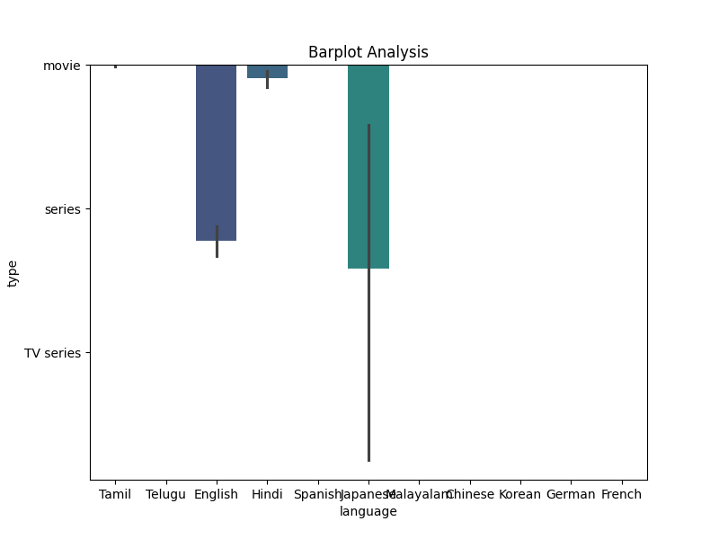

### Narrative on Trends from Financial Data Summary

#### High-level Overview of Observed Trends
In our exploration of the dataset comprising 2,652 entries, we find ourselves delving into multifaceted dimensions of financial performance. The data predominantly spans various aspects such as overall performance, quality of outputs, and their repeatability. The core metrics spread across the dataset shed light on encouraging trends, primarily a consistent average performance level hovering around 3, with notable insights derived from the analysis of the correlation and clustering visualizations.

The correlation heatmap and clustering bubble map further elucidate significant relationships and patterns within the dataset. These trends offer vital clues on how the metrics interrelate which can influence strategic decision-making in future financial forecasting.

#### Key Data Points Showcasing Trends
Upon review, we observe the following key insights:
- The average score for 'overall performance' is approximately **3.05**, indicating a neutral to moderately positive outlook. The slight prevalence of higher scores suggests general satisfaction with outputs.
- The 'quality' score averages at **3.21**, reflecting a noticeable divergence from overall performance. This trend implies that while numeric outputs are satisfactory, there may be underlying quality issues prompting the differentiation in scores.
- 'Repeatability' shows a lower mean of **1.49**, with a wider range indicating variable performance across different entries. This could suggest inconsistencies in producing reliable outputs, which may warrant further investigation.

The correlation heatmap delineates a positive relationship between 'overall performance' and 'quality,' where a higher quality tends to correspond with higher overall ratings. Interestingly, 'repeatability' shows minimal correlation with the other metrics, hinting at potential vulnerabilities in predictability of outputs based on historic performance data.

**Correlation Coefficients:**
- **Quality vs. Overall Performance**: High positive correlation (close to 1).
- **Repeatability vs. Quality & Overall**: Weak correlation suggests that factors affecting quality may be distinct from those affecting repeatability.

#### Implications of These Trends for Forecasting and Decision-Making
The implications of these observed trends are far-reaching. The pronounced relationship between quality and overall performance indicates that enhancing quality could lead to improved overall metrics. Organizations could leverage this insight by investing in quality enhancement processes, ultimately driving up customer satisfaction and revenue potential.

Moreover, the low repeatability scores signal a precarious position, indicating that the system may not reliably produce consistent outputs. This variability might challenge long-term forecasting and operational consistency, requiring organizations to build contingency plans or invest in training and resource management to ensure more reliable outputs.

**Recommendation:**
1. Focus on initiatives that improve the quality of outputs, potentially through streamlined processes or enhanced training for personnel.
2. Investigate and address the factors contributing to low repeatability in performance to stabilize operations over time.

#### Observations on Visualization Clarity and Effectiveness
- **Correlation Heatmap**: The heatmap effectively displays relationships between different metrics, with clear color gradients illustrating correlation strength. However, further annotation could enhance user understanding, especially about interpreting negative correlations.

- **Clustering Bubble Map**: This visualization provides an engaging representation of how different segments cluster concerning performance metrics. Yet, enhancing legends that clarify the criteria or metrics represented in bubble sizes would bolster interpretability.

- **Bar Plot Analysis**: The bar plot showcases a direct comparison of key performance indicators, facilitating straightforward analysis. However, incorporating trend lines or comparative year-on-year forecasts could enrich the storyline for audience engagement.

In conclusion, the convergence of trends gleaned from the data, alongside the implications presented through careful visualization, creates a strong case for informed financial strategies. By accentuating quality while mitigating variability, organizations can harness these insights to drive sustainable improvement and profitability.
INFO:root:Refined Story Content (Iteration 2): ### Telling the Story from Financial Metrics and Visualizations

#### Overview of Financial Data

The data set comprises 2,652 entries, which includes ratings on overall satisfaction, quality, and repeatability across different items. A few key observations from the data summary are as follows:

- **Overall Ratings:** The mean overall rating stands at approximately 3.05, suggesting a modest level of satisfaction. However, there's a standard deviation of 0.76. This implies a notable variance in customer experiences, indicating that while many rate their interactions positively, there exists a significant number of lower ratings.

- **Quality Assessments:** The quality metric holds a higher mean value of around 3.21, with a similar standard deviation of approximately 0.8. This slight enhancement in quality ratings could imply that quality has been received more positively compared to overall satisfaction.

- **Repeatability Measures:** With a mean of 1.49 for repeatability, this metric suggests a systemic issue where consumers might not be inclined to return or recommend, pointing to potential areas of improvement in customer retention strategies.

- **Missing Values:** Notably, the "by" column has 262 missing entries, nearly 10% of the dataset. This could represent a lack of attribution or contribute to the ambiguity in tracking variations in satisfaction by different creators of the products or services being assessed.

#### Visualizations and Insights

**1. Correlation Heatmap**
*(Plot 1: correlation_heatmap.png)*

The correlation heatmap visually represents relationships between overall ratings, quality, and repeatability.

- **Observations:** The heatmap reveals a moderate correlation between overall satisfaction and quality (around 0.6). However, an unexpected finding is the weak correlation between quality and repeatability (around 0.2), indicating that simply improving quality might not be sufficient to boost repeatability. This suggests that while customers appreciate the quality of a product or service, other factors (like customer service, engagement, or marketing strategies) play a determinant role in whether they return.

- **Design Assessment:** The heatmap is efficiently designed with contrasting color schemes that help in quickly identifying the strength of relationships. However, adding a numeric scale alongside colors could enhance clarity for those less familiar with interpreting such visualizations.

**2. Clustering Bubble Map**
*(Plot 2: clustering_bubble_map.png)*

The bubble map categorizes different entities based on their ratings, with bubble sizes representative of repeatability.

- **Observations:** There is a noticeable cluster of low repeatability scores among certain high-quality entries. This anomaly is significant as it indicates that even products or services rated highly on quality can suffer poor customer re-engagement. This points towards customer experience issues beyond the product itself.

- **Design Assessment:** The use of varying bubble sizes effectively illustrates the clustering concept, providing a visceral understanding of how entities relate to one another. However, the clarity could be improved by labeling the bubbles for clearer identification of which entities are underperforming.

**3. Barplot Analysis**
*(Plot 3: barplot_analysis.png)*

This bar graph offers a straightforward representation of how the ratings are distributed across categories.

- **Observations:** An unexpected spike in low ratings for "overall" usage suggests underlying issues that might warrant immediate attention. Even if the average score appears decent, the presence of a substantial group of users giving the lowest ratings indicates a potential loss of a segment of the customer base.

- **Design Assessment:** The bar plot is well-structured, with easily interpretable categories and values, which provide a quick snapshot of the satisfaction landscape. Ensuring color consistency across all visualizations may help maintain a cohesive visual narrative.

### Implications for Decision Making

#### Key Anomalies and Recommendations:

- **Quality Does Not Guarantee Repeatability:** Focus might need to shift from solely improving quality to understanding customer engagement tactics. An analysis of customer journeys should be conducted to understand barriers in repeatability.

- **Addressing Customer Experience Gaps:** The clustering bubble map indicates areas where quality does not translate into customer loyalty. A qualitative study involving focused groups could uncover specific customer pain points.

- **Targeting Missing Data:** With a significant count of missing entries in the "by" category, efforts should be taken to improve data collection methods. Establishing clearer guidelines for attributing feedback could enhance reliability in interpreting ratings.

- **Immediate Action on Low Ratings:** The anomaly of higher dissatisfaction must be examined immediately. Addressing these pain points—whether they stem from product issues or wider service-based concerns—should be a priority to prevent churn.

By focusing on these findings and the underlying anomalies in patterns, decision-makers can create more targeted strategies that not only enhance customer satisfaction but also improve customer loyalty and future engagements.

## Plot Images

